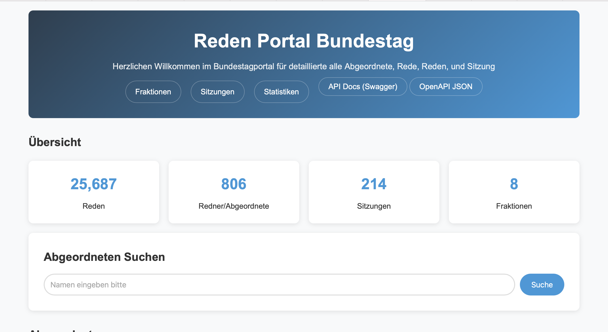

# Bundestag Reden Portal
A Java web application for exploring speeches, speakers, sessions, and factions of the German Bundestag.
Built with Javalin, Java, and FreeMarker templates, this project allows users to browse, search, and analyze parliamentary speeches and related statistics.

## Project Description
In this project, a REST API is used that includes all CRUD operations (GET, POST, PUT, DELETE).
Most endpoints are implemented using GET, but for the Redner, I implemented the full set of CRUD operations.
FreeMarker is also used, along with FTL templates and CSS files located in the resources folder.

## Features
- Browse Data: View all speeches (Reden), speakers (Redner), sessions (Sitzungen), and political factions (Fraktionen).
- Top Speakers & Statistics: Identify top speakers, see statistics like average speech length, number of speeches per faction, and comment counts.
- Search & Filter: Search for speakers by name, filter speeches by speaker (A-Z or Z-A) and faction (A-Z or Z-A).
- REST API: Provides JSON endpoints for integration or programmatic access.
- Swagger UI: Automatically generated API documentation for easy testing and exploration. (Bonusaufgabe)

## Technology
- Language: Java 21+
- Web Framework: Javalin
- Template Engine: FreeMarker (.ftl files)
- Data Handling: In memory collections stored in ObjectFactory (for demonstration purposes)
- API Documentation: Swagger/OpenAPI 

## Daten
The application reads XML files from the /resources/20/ folder (directory). 
This folder contains all Bundestag data in XML format, which are parsed and loaded when the application starts.

## Installation/Run
1. Navigate to utils package
2. Run the class:
      MainUbung3  
      (org.texttechnologylab.ppr.blatt3.utils.MainUbung3)
3. Open the app in browser:
   👉 http://localhost:7070

## API Endpoints (JSON)
| Endpoint                 | Description                                                                |
| ------------------------ | -------------------------------------------------------------------------- |
| /api/redner              | List all speakers (filter by fraktion, search, or sort)                    |
| /api/redner/{id}         | Get details of a specific speaker by ID                                    |
| /api/reden               | List all speeches (filter by rednerId, fraktion, sitzung, or sort)         |
| /api/reden/{id}          | Get details of a specific speech by ID                                     |
| /api/fraktionen          | List all factions                                                          |
| /api/fraktionen/{name}   | Get details and statistics of a specific faction                           |
| /api/sitzungen           | List all sessions                                                          |
| /api/sitzungen/{id}      | Get details of a specific session                                          |
| /api/statistiken         | Get overall statistics of speeches, speakers, and factions                 |

## Swagger UI
Interactive API documentation is available at: http://localhost:7070/swagger .
Use this interface to explore all available routes, test queries, and see response structures.
- Note: But there is error in speeches (Rede) and sessions (Sitzung), because `java.time.LocalTime` not supported by default: add Module \"com.fasterxml.jackson.datatype:jackson-datatype-jsr310\"

## Roadmap
Additional features may be added in the future.

## Contributing
This project is part of a university assignment for Blatt 3 in the course ProgrammierPraktikum (PPR).

## Authors 
Author: Athalia Bernice Phalosa

## Project status
The project is completed for the university assignment.

## Screenshots

### Homepage

